## Service Notes

  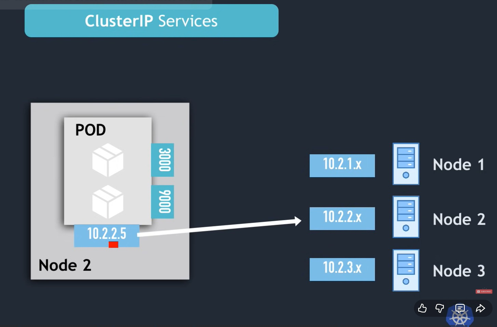

---

  

---

  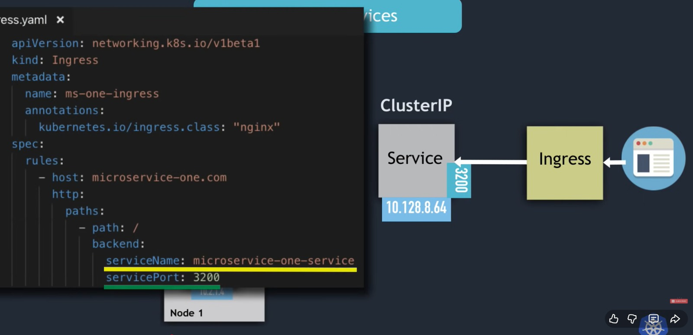

---

  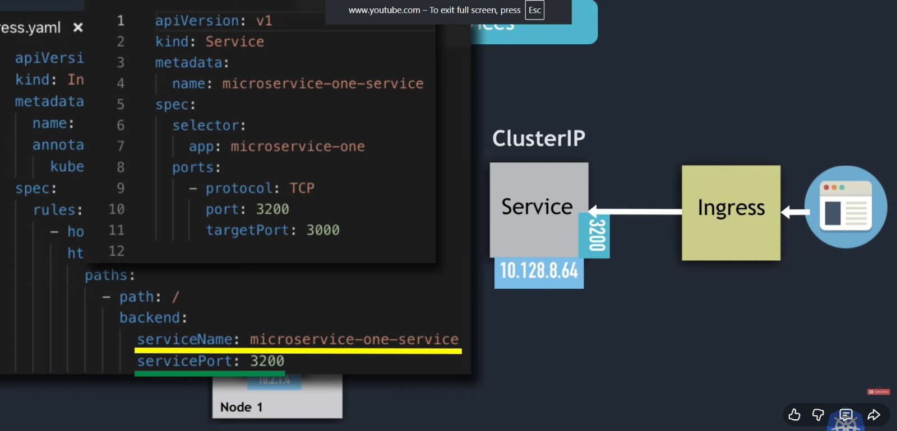

---

  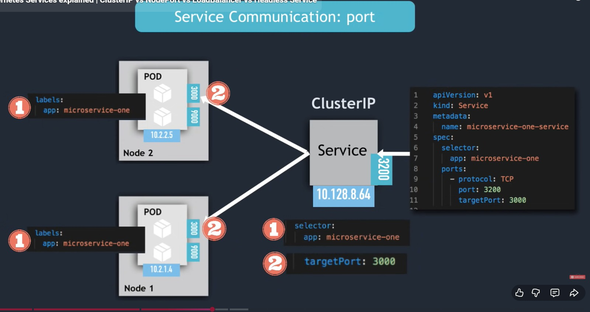

---

  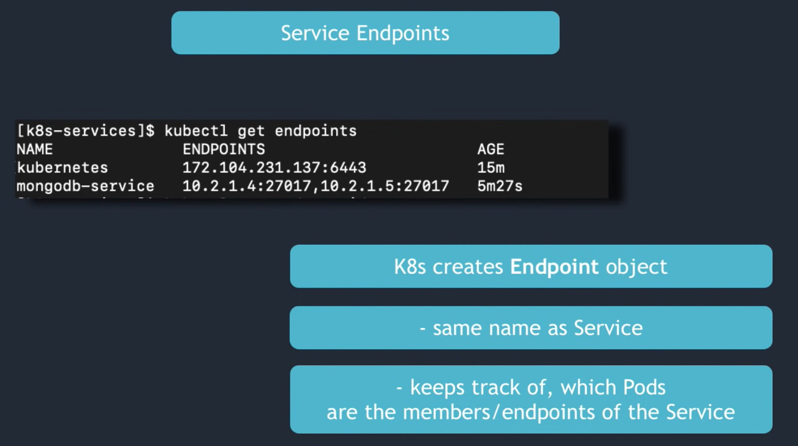

---

  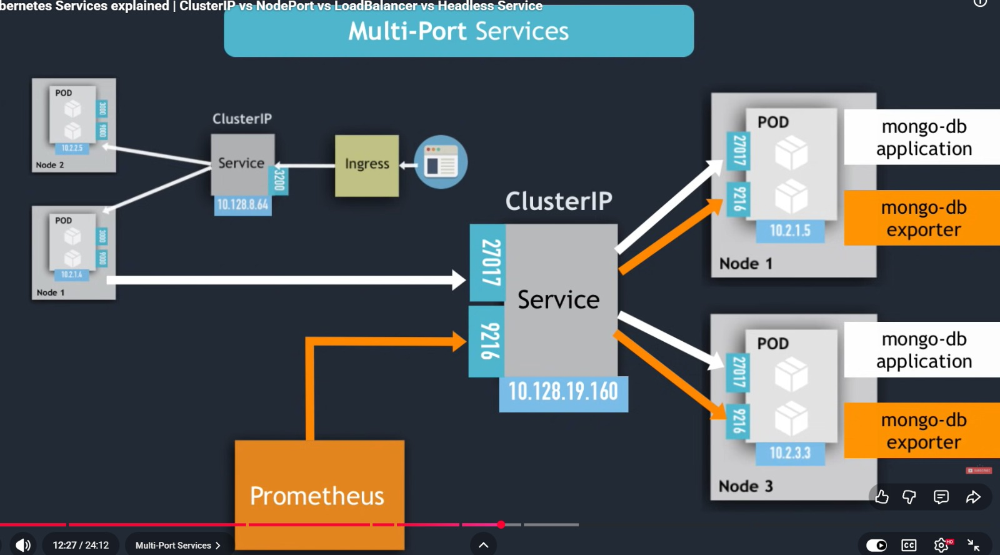

---

  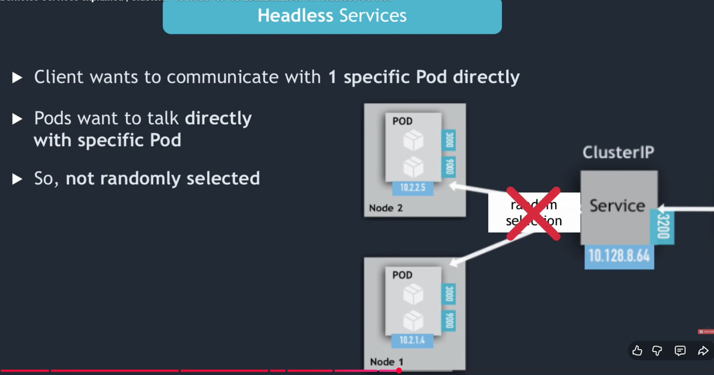

---

  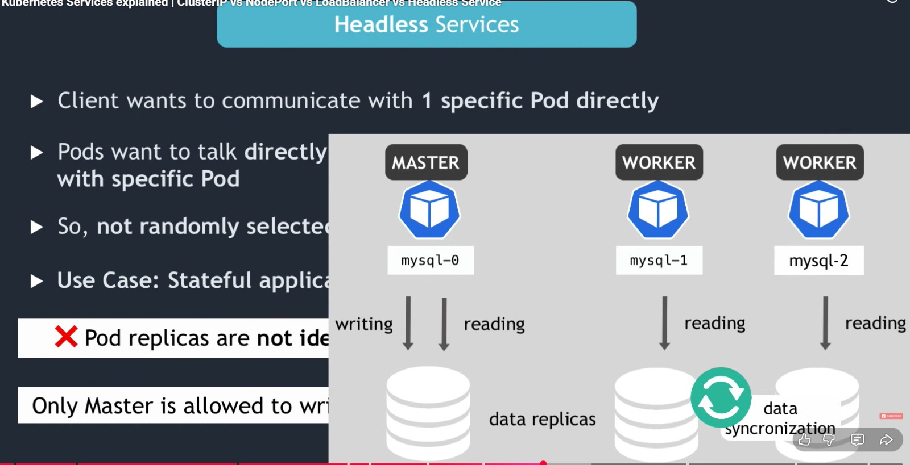

---

  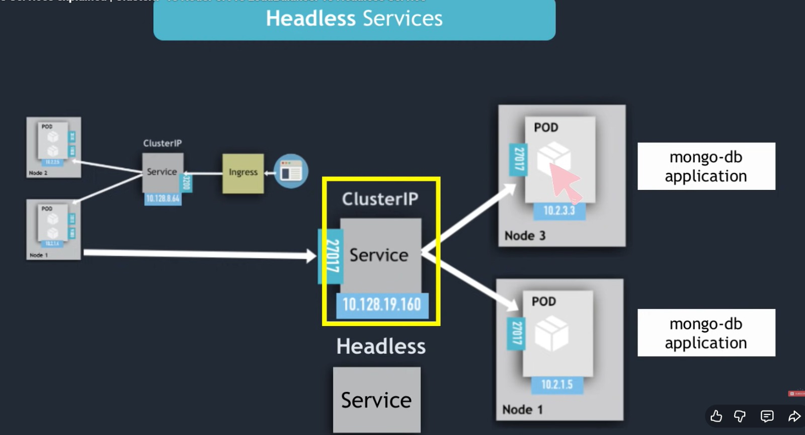

---

  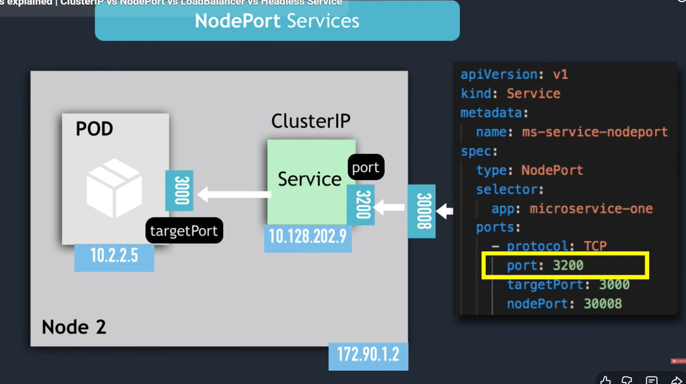

---

  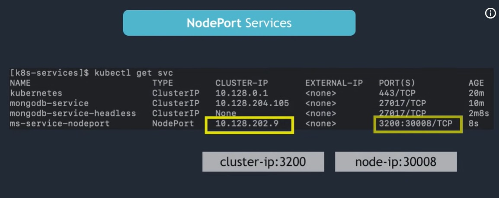

---

  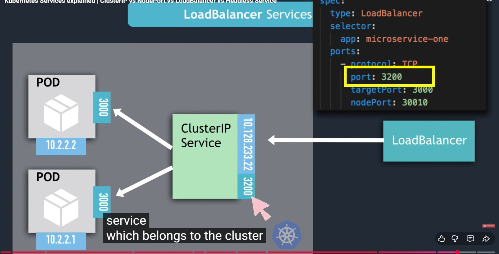

---

  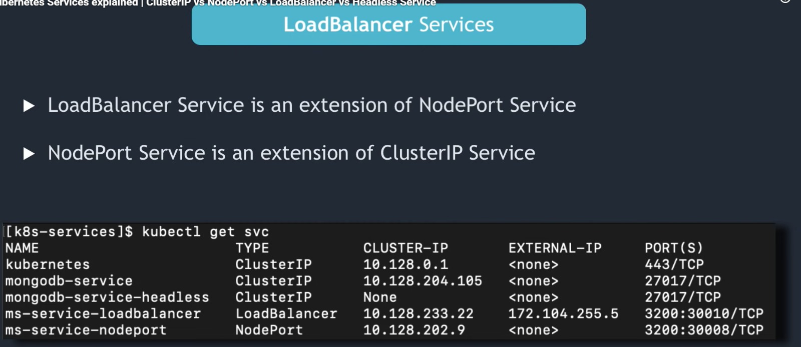

Service IP is associated with every service(except for Headless service and external service). We call it clusterIP. 
Nodeport service madhe pn clusterip (service IP) asto, if you observe in the above image. 
Loadbalancer service madhe pn clusterip as well as external ip asto(cloud providers create a load balancer for it for external access) 
Headless service & extername service madhe clusterip nasto 

---

  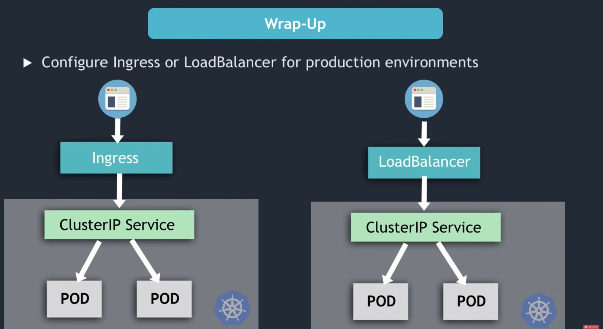

