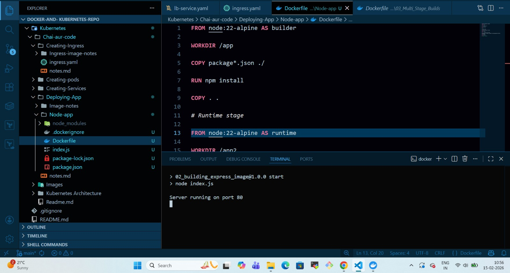

# 🚀 NGINX Ingress Setup in Kind (Kubernetes in Docker)

This guide explains how to deploy an **NGINX Ingress Controller** inside a **Kind cluster** and configure it to route traffic to your application using an `ingress.yaml`.

---

## 📌 Prerequisites

Make sure you have installed:

* Docker
* Kind
* kubectl

Verify installations:

```bash
docker --version
kind --version
kubectl version --client
```

---

# 🏗️ Step 1: Create Kind Cluster with Port Mapping

Kind runs inside Docker, so you must expose ports **80** and **443**.

Create a file:

## `kind-config.yaml`

```yaml
kind: Cluster
apiVersion: kind.x-k8s.io/v1alpha4
nodes:
- role: control-plane
  extraPortMappings:
  - containerPort: 80
    hostPort: 80
    protocol: TCP
  - containerPort: 443
    hostPort: 443
    protocol: TCP
```

Create the cluster:

```bash
kind create cluster --config kind-config.yaml
```

If a cluster already exists without port mapping:

```bash
kind delete cluster
kind create cluster --config kind-config.yaml
```

---

# 🌐 Step 2: Install NGINX Ingress Controller

Apply the official Kind deployment manifest:

```bash
kubectl apply -f https://raw.githubusercontent.com/kubernetes/ingress-nginx/main/deploy/static/provider/kind/deploy.yaml
```

---

# ⏳ Step 3: Wait for Controller to Be Ready

Check pods:

```bash
kubectl get pods -n ingress-nginx
```

Wait until you see:

```
ingress-nginx-controller-xxxxx   Running
```

Check service:

```bash
kubectl get svc -n ingress-nginx
```

---

# 📦 Step 4: Deploy Your Application

Apply your deployment and service:

```bash
kubectl apply -f deployment.yaml
kubectl apply -f service.yaml
```

Verify:

```bash
kubectl get pods
kubectl get svc
```

---

# 🔀 Step 5: Apply Ingress Resource

```bash
kubectl apply -f ingress.yaml
```

Verify:

```bash
kubectl get ingress
```

Example output:

```
NAME        CLASS   HOSTS         ADDRESS   PORTS
my-ingress  nginx   myapp.local            80
```

---

# 🖥️ Step 6: Update Local Hosts File

If your ingress uses:

```yaml
host: myapp.local
```

Add this entry:

## Linux / Mac

```bash
sudo nano /etc/hosts
```

Add:

```
127.0.0.1 myapp.local
```

## Windows

Edit:

```
C:\Windows\System32\drivers\etc\hosts
```

Add:

```
127.0.0.1 myapp.local
```

---

# 🧪 Step 7: Test the Setup

Using curl:

```bash
curl http://myapp.local
```

Or open in browser:

```
http://myapp.local
```

You should see your application 🎉

---

# 📄 Example `ingress.yaml`

```yaml
apiVersion: networking.k8s.io/v1
kind: Ingress
metadata:
  name: my-ingress
spec:
  ingressClassName: nginx
  rules:
  - host: myapp.local
    http:
      paths:
      - path: /
        pathType: Prefix
        backend:
          service:
            name: my-service
            port:
              number: 80
```

---

# 🧭 Traffic Flow Architecture

```
Browser
   ↓
Ingress
   ↓
Service (ClusterIP)
   ↓
Pod
```

---

# 🛠️ Debugging Checklist

Check ingress:

```bash
kubectl describe ingress <ingress-name>
```

Check controller logs:

```bash
kubectl logs -n ingress-nginx deploy/ingress-nginx-controller
```

Check endpoints:

```bash
kubectl get endpoints
```

---

# ✅ Best Practices

* Use `ClusterIP` service type with Ingress
* Always specify `ingressClassName: nginx`
* Avoid using `latest` image tag in Kubernetes
* Ensure service selector matches deployment labels

---

# 🎯 Summary

1. Create Kind cluster with port mapping
2. Install NGINX Ingress Controller
3. Deploy app and service
4. Apply ingress resource
5. Update `/etc/hosts`
6. Test in browser

## Demo which I did

Building a Docker image from 

<p align="center">
  
</p>
