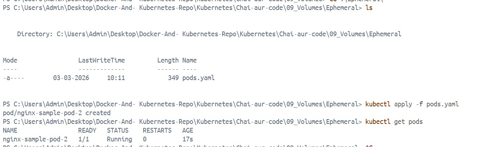

# Kubernetes Storage

## Table of Contents

- [Kubernetes Storage](#Kubernetes-Storage)
- [Types of Volumes](#Types-of-volumes)
- [Ephemeral Volumes](#ephemeral-volume)
- [Persistent Volumes](#persistent-volume)
- [Persistent Volume Claims](#persistent-volume-claim)
- [Access Policies](#access-policies)
- [Static and Dynamic Provisioning](#Static-and-Dynamic-Provisioning)
- [Reclaim Policies](#Reclaim-Policies)
- [Storage Classes](#Storage-classes)
- [Demo](#Demo)

Here are clean, well-structured notes you can directly copy into your Markdown file:

---

# Kubernetes Storage

Storage in Kubernetes allows containers to persist data beyond the lifecycle of a single Pod. By default, containers are ephemeral — when a Pod is deleted, its data is lost. Kubernetes solves this using **Volumes**, **PersistentVolumes (PV)**, and **PersistentVolumeClaims (PVC)**.

Storage in Kubernetes supports:

* Ephemeral storage (lives and dies with the Pod)
* Persistent storage (survives Pod restarts and rescheduling)
* Static and dynamic provisioning
* Multiple storage backends (NFS, cloud disks, CSI drivers, etc.)

---

## Types of Volumes

In Kubernetes, a **Volume** is a directory accessible to containers in a Pod.

There are two broad categories:

1. **Ephemeral Volumes**

   * Exist only for the lifetime of the Pod
   * Deleted when the Pod is deleted

2. **Persistent Volumes**

   * Exist independently of Pods
   * Survive Pod restarts and deletion

---

## Ephemeral Volumes

Ephemeral volumes are created and deleted along with the Pod.

### Common Types:

### 1. `emptyDir`

* Created when Pod starts
* Stored on node disk (or memory if configured)
* Deleted when Pod is removed
* Useful for:

  * Caching
  * Temporary files
  * Sharing data between containers in the same Pod

### 2. `configMap`

* Injects configuration data into Pods
* Stores non-sensitive configuration

### 3. `secret`

* Stores sensitive data like passwords, tokens, certificates
* Base64 encoded

### 4. `downwardAPI`

* Exposes Pod metadata (like labels, annotations) to containers

### 5. CSI Ephemeral Volumes

* Provided by CSI drivers
* Inline ephemeral storage support

---

## Persistent Volumes

A **PersistentVolume (PV)** is a cluster-wide storage resource.

It is:

* Provisioned by an administrator or dynamically
* Independent of any Pod
* Backed by real storage (EBS, Azure Disk, NFS, etc.)

### Key Characteristics:

* Has a defined capacity (e.g., 10Gi)
* Has access modes
* Has a reclaim policy
* Bound to a PersistentVolumeClaim

---

## Persistent Volume Claims

A **PersistentVolumeClaim (PVC)** is a request for storage by a user.

Think of it like:

* **Pod → PVC → PV → Actual Storage**

The PVC specifies:

* Required storage size
* Access mode
* Storage class (optional)

If a matching PV exists, Kubernetes binds the PVC to it.

Example flow:

1. User creates PVC
2. Kubernetes finds matching PV
3. PVC binds to PV
4. Pod mounts PVC

---

## Access Policies

Access modes define how a volume can be mounted.

### 1. ReadWriteOnce (RWO)

* Mounted as read-write by a single node

### 2. ReadOnlyMany (ROX)

* Mounted as read-only by many nodes

### 3. ReadWriteMany (RWX)

* Mounted as read-write by many nodes

### 4. ReadWriteOncePod (RWOP)

* Mounted by only one Pod at a time

> Note: Actual support depends on the storage backend.

---

## Static and Dynamic Provisioning

### Static Provisioning

* Admin manually creates PersistentVolumes
* PVC binds to an existing PV

Flow:

1. Admin creates PV
2. User creates PVC
3. Kubernetes binds them like whenever we create kubernetes manifests like pod.yaml or deployment.yaml we provide the persistent volume and persistent volume claim on that

Use case:

* Pre-provisioned storage
* On-prem environments

---

### Dynamic Provisioning

* Kubernetes automatically provisions storage
* Triggered by PVC
* Requires a StorageClass

Flow:

1. User creates PVC
2. StorageClass provisions new PV automatically
3. PVC binds to newly created PV

Common in cloud environments.

---

## Reclaim Policies

Reclaim policy defines what happens to the PV after the PVC is deleted.

### 1. Retain

* PV is not deleted
* Data remains
* Manual cleanup required

### 2. Delete

* PV and underlying storage are deleted automatically

### 3. Recycle (Deprecated)

* Basic scrub (`rm -rf`)
* Not recommended

---

## Storage Classes

A **StorageClass** defines:

* Provisioner (e.g., AWS EBS, GCE PD, CSI driver)
* Parameters (disk type, IOPS, etc.)
* Reclaim policy
* Volume binding mode

It enables dynamic provisioning.

Example capabilities:

* SSD vs HDD
* High IOPS disks
* Encrypted volumes
* Regional or zonal storage

### Volume Binding Modes

1. `Immediate`

   * PV is provisioned immediately after PVC creation

2. `WaitForFirstConsumer`

   * PV created only when Pod is scheduled
   * Helps with topology-aware provisioning

---

## Summary Architecture

```
Pod
  ↓
PersistentVolumeClaim (PVC)
  ↓
PersistentVolume (PV)
  ↓
Storage Backend (EBS / NFS / Azure Disk / CSI)
```

---

Demo which I did :  

<p align="center">
  
</p>

