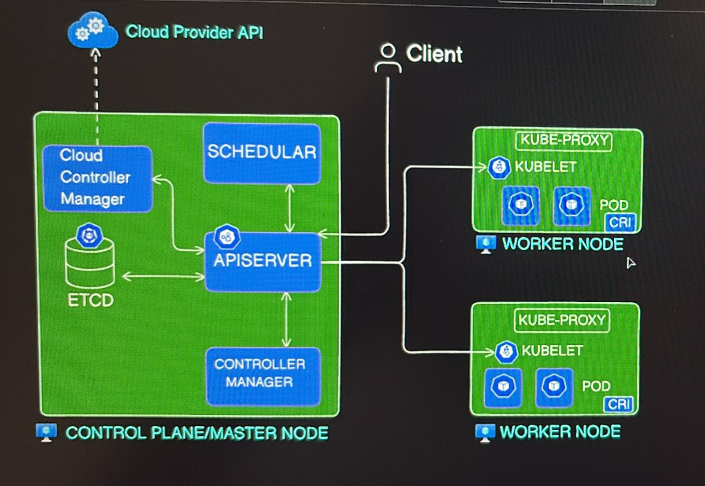

Creating cluster in kubernetes
```
kind create cluster --name <cluster-name>
kind get clusters
kind delete cluster --name <cluster-name>
kind create cluster --name <multi-node-cluster-name> --config <config-file-path>
```

Getting cluster information
```
kubectl cluster-info --context kind-my-first-cluster
```

Setting kubectl configuration for the cluster:
```
kubectl config use-context kind-<cluster-name>
kubectl config get-contexts
kubectl config current-context
```

Kubernetes objects can be created using imperative way(via commands) or declarative way(yaml files)


Getting nodes of cluster
```
kubectl get nodes
```


pods commands
```
kubectl get pods
kubectl get pods --watch # for real time instead of entering this command multiple times 
kubectl get pods -A        # all namespaces
kubectl get pods -o wide   # more details (IP addresses vagere distat)
kubectl get pods nginx-pod -o yaml
kubectl get pods -n <specific-namespaces>
kubectl get pods --show-labels
kubectl get pods -o wide
```

Namespaces
```
kubectl get namespaces
```


Deployments
```
kubectl create deployment my-dep --image=nginx --replicas=3
kubectl get deployments
```


Replicasets
```
kubectl get rs
```

Services
```
kubectl get svc/kubectl get service

```

Creating a deployment.yaml file and deploy the pods
```
kubectl run --image=nginx nginx-pod 
kubectl apply -f deployment.yaml
kubectl run --image=nginx nginx-pod --dry-run=client -o yaml
```

Deleting pods/deployments
```
kubectl delete pod my-pod
kubectl delete deployment my-app
kubectl delete -f app.yaml
kubectl delete pods --all
```

Commands for Debugging
```
kubectl describe pod my-pod
kubectl describe deployment my-app
kubectl logs my-pod
kubectl logs my-pod -c my-container #If a pod contains multiple container
kubectl exec -it my-pod -- /bin/bash # get inside a running pod
kubectl exec -it my-pod -- sh # for alpine images
```

## Theoretical notes  
### Kubernetes Architecture:  
<p align="center">
  
</p>

### Replicasets and Deployments:
A deployment is something which will create a replicaset and which inturn manages replicas of the pods  
Even if we delete any pod, deployment controller will make sure that it will have desired number of pods

```
kubectl create deployment my-dep --image=nginx --replicas=3
kubectl get deployments
kubectl describe deployment my-dep 
kubectl edit deployment my-dep
kubectl scale deployments my-dep --replicas=7 # To scale the deployments
```

Deployment.yaml can also be created and 
```
kubectl apply -f deployment.yaml
```

Rollout a deployment
```
kubectl rollout restart deployment/my-app # Restart the pods
kubectl rollout history deployments # to check revision
kubectl rollout undo deployment/my-app # Rollout to previous versions
kubectl rollout -h # for checking how to use this commands
```

## Services 
A service has its own IP and port(port) and it points to targetports of the pods

3 Types
a. Nodeport service: 
b. ClusterIP service: 
c. Loadbalancer service:


### ClusterIP service:
service is also created by its deployment name
```
kubectl expose deployment <deployment-name> --port=80
kubectl get service
kubectl describe service <deployment-name>
```

ClusterIP service are meant to be accessible from only inside your cluster, like backends of application or databases
```
kubectl port-forward svc/dep 8080:80 # In case if you wanna access
```
You can even create a yaml file and apply that to create service declaratively

## The Key Difference between Service Port and Node Port  
Service Port (port): The "Internal" door. It is the port used inside the cluster. Other Pods in the same cluster talk to your service using this port.  
NodePort (nodePort): The "External" door. It is a specific port (range 30000–32767) opened on every Node's IP address. It allows users outside the cluster to reach the service.   

How Traffic Flows  
When a request comes from the outside world, it moves through these ports in order:  
NodePort: External traffic hits Node_IP:NodePort (e.g., 172.18.0.2:30007).
Service Port: The NodePort forwards that traffic to the internal Service Port (e.g., 80).  
TargetPort: The Service then sends the traffic to the targetPort (e.g., 80) on the actual Pod where your app is running.   
